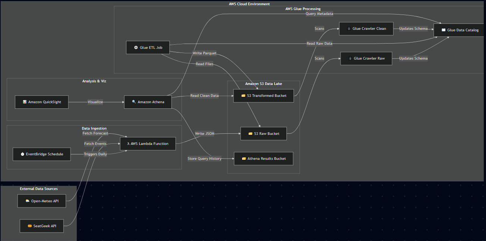
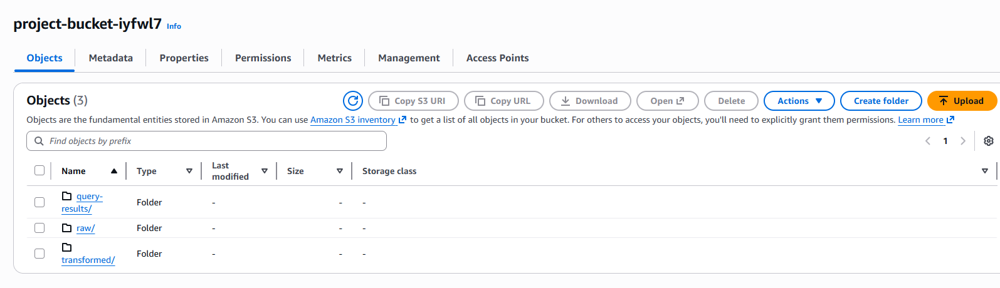
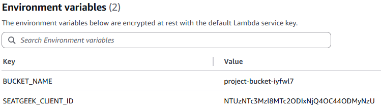
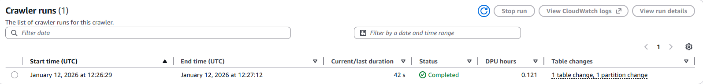
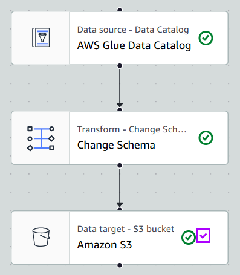
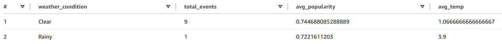
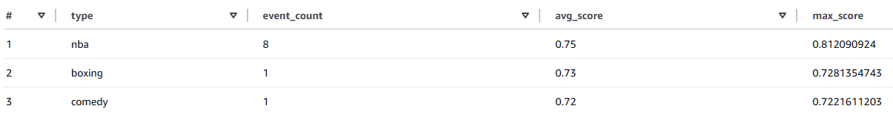

# AWS Project IYFWL7

During the course of this project, I was tasked to create a full data pipeline using AWS to read, transform and analyze data,
similar to the Capstone Project. The business case I decided to proceed with was to use weather data to analyze what types of events
are most popular in America (specifically, in New York City in this scenario) and how weather influences popularity rates (essentially
showing how many people would go, since the site used was a ticket purchasing site similar called SeatGeek).

The two APIs used were SeatGeek and OpenMeteo APIs - the former to fetch event data for New York City, and the latter to fetch the
weather data for the given day. The exact structure of the code and tables will be explored later.

---

## 1. 👥 Stakeholders & Value
**Target Audience:** 
The main target audience would be mostly event organizers and marketing teams. Using the analyses from this project (or a more detailed version of this project) they could
create profiles for certain types of events (for example, how NBA events seemed to be the most popular), or use this data to better be able to nail down a target marketing demographic.

**Business Benefits:**
The most obvious benefit of a project like this would be preliminary analysis to reap a number of benefits. Anything from risk mitigation through
dynamic price optimization to ensure maximalization of profits or attendance rates could be done with a successful analysis of the data gathered throughout this project.

---

## 2. 🏗️ Pipeline Architecture
This project implements a **Serverless Data Pipeline** on AWS to minimize maintenance and costs while ensuring scalability.

### Architecture Diagram
 
(Note: daily/weekly calls would only be an option if this were actually implemented for a business case - for the sake of this project I stuck with manual calls)

### The Data Flow
1.  **Ingestion (AWS Lambda):** A Python script fetches live event data (SeatGeek API) and weather forecasts (Open-Meteo API).
2.  **Storage (Amazon S3):** Data is partitioned and stored in a **Raw Data Lake**.
3.  **Transformation (AWS Glue):** A Glue Crawler infers the schema, and a Visual ETL job cleans/joins the data into **Parquet** format.
4.  **Analytics (Amazon Athena):** SQL queries derive insights on the correlation between weather and popularity.

Using this data flow, we are able to get a unified and transformed table of a standardized format into Amazon Athena, which can be
used to carry out analytics and infer business insights.

### Cost Analysis
The estimated running cost is **<$0.60 per month**, since most of the services used are low-cost at the level of a university project.
* **AWS Lambda:** Free tier (or <$0.01 for daily runs).
* **AWS Glue:** ~$0.44 per run (minimal usage for batch processing - might increase in case of eg. weekly runs because of weather data).
* **Amazon S3:** ~$0.02 for storage.
* **Amazon Athena:** $5.00 per TB scanned (we scan MBs, so <$0.01).

---

## 3. 📈 Key Performance Indicators (KPIs)
A good project must always have ways that we can keep track of how it's doing - that's where KPIs come in. These are the following
KPIs I decided could be a good fit for this project if it were to be implemented in the real world:

1.  **Popularity-Weather Correlation Coefficient:**
    * *Definition:* Measures how strongly rain/temperature impacts the SeatGeek "Score".
    * *Goal:* Identify a correlation > 0.5 to prove weather is a valid predictor.
3.  **High-Risk Event Identification Rate:**
    * *Definition:* The number of "High Popularity" events flagged with "Severe Weather" warnings per month.
    * *Value:* Direct operational savings for organizers, ensuring that the popularity doesn't go to waste thanks to bad weather.
4.  **Pipeline Latency:**
    * *Definition:* Time taken from API Data Fetch -> Dashboard availability.
    * *Goal:* < 10 minutes to ensure organizers have fresh morning data and make sure operations run smoothly.

---

## 4. 💻 Implementation & Results

### A. Data Ingestion (Code)

The first order of business was to create an **S3 bucket** to store my data in. For this, I created three separate buckets -
one for *raw data*, one for *transformed data*, and one to store *query results* in.


Following this, I created the **Lambda** code necessary to call the API and store the data in the proper S3 bucket folder. The code can be found below (along with the used environment variables):


```python
import json
import os
import boto3
import urllib3
from datetime import datetime

# Initialize S3 and HTTP client
s3 = boto3.client('s3')
http = urllib3.PoolManager()

def lambda_handler(event, context):
    # 1. Get Configuration from Environment Variables
    CLIENT_ID = os.environ.get('SEATGEEK_CLIENT_ID')
    BUCKET = os.environ.get('BUCKET_NAME')
    
    # 2. Settings: Fetch events for a specific city - eg. New York
    CITY = "New York" 
    EVENTS_URL = f"https://api.seatgeek.com/2/events?client_id={CLIENT_ID}&venue.city={CITY}&per_page=10&sort=score.desc"
    
    extracted_data = []

    try:
        print(f"Fetching events from SeatGeek for {CITY}...")
        r_events = http.request('GET', EVENTS_URL)
        events_data = json.loads(r_events.data.decode('utf-8'))

        # 3. Loop through each event
        for event in events_data.get('events', []):
            event_title = event['title']
            # Get YYYY-MM-DD for weather lookup
            event_date = event['datetime_local'].split('T')[0] 
            lat = event['venue']['location']['lat']
            lon = event['venue']['location']['lon']
            popularity_score = event['score'] 

            # 4. Fetch Weather for THIS specific event's location & date
            # Using Open-Meteo 'forecast' endpoint
            weather_url = (
                f"https://api.open-meteo.com/v1/forecast?"
                f"latitude={lat}&longitude={lon}&daily=temperature_2m_max,precipitation_sum"
                f"&start_date={event_date}&end_date={event_date}&timezone=auto"
            )
            
            r_weather = http.request('GET', weather_url)
            weather_data = json.loads(r_weather.data.decode('utf-8'))
            
            # Extract weather metrics safely
            try:
                temp_max = weather_data['daily']['temperature_2m_max'][0]
                precip = weather_data['daily']['precipitation_sum'][0]
            except (KeyError, IndexError):
                temp_max = None
                precip = None

            # 5. Build the record
            record = {
                "event_name": event_title,
                "date": event_date,
                "location": event['venue']['display_location'],
                "latitude": lat,
                "longitude": lon,
                "popularity_score": popularity_score,
                "forecast_max_temp": temp_max,
                "forecast_rain_mm": precip,
                "type": event['type']
            }
            extracted_data.append(record)

        # 6. Save to the RAW FOLDER with Partitioning
        # Structure: s3://bucket/raw/year=2024/month=05/day=20/data.json
        now = datetime.now()
        s3_key = f"raw/year={now.year}/month={now.month:02d}/day={now.day:02d}/seatgeek_weather_{now.strftime('%H%M%S')}.json"
        ndjson_data = '\n'.join(json.dumps(record) for record in extracted_data)

        s3.put_object(
            Bucket=BUCKET,
            Key=s3_key,
            Body=ndjson_data,
            ContentType='application/json'
        )

        return {
            'statusCode': 200,
            'body': json.dumps(f"Success! Saved to bucket {BUCKET} at key {s3_key}")
        }

    except Exception as e:
        print(f"Error: {e}")
        return {
            'statusCode': 500,
            'body': json.dumps(f"Error: {str(e)}")
        }
```


### B. Transformation (AWS Glue)
Now that we have our code, we can move on to automating the retrieval process. The simplest way to use this is with **AWS Glue**, specifically its **Crawlers**. Therefore, I set up a crawler to crawl through
the data and transform it into a parquet file for easier work later down the line.


With the crawler up and running, it's great that we have our data, but it is essentially worthless if it isn't in the proper format. That's why I used Glue's **ETL Job** to transform
all read data into a predetermined schema to ensure:
1.  **Schema Enforcement:** Converting string fields (like `popularity_score`) into Double/Float for easier mathematical analysis, and
2.  **Performance:** Parquet files are faster and cheaper to query in Athena than raw JSON.

**The ETL Process Itself:**
* **Source:** Reads raw data from `s3://project-bucket-iyfwl7/raw/`.
* **Transform:** Renames fields and changes data types.
* **Target:** Writes clean Parquet files to `s3://project-bucket-iyfwl7/transformed/`.



### C. Analysis of Results (Athena)
Finally, with the data in a proper format, I could move on to some basic analysis using **Amazon Athena** to show the potential within this project.
It is worth noting that the data called from the API was of a small volume, so the analytical opportunities with this data are limited.

**Query 1: Analysis of Rain Impact**
The first SQL query groups events by weather condition to compare average popularity scores and temperatures.

```sql
SELECT 
    CASE 
        WHEN forecast_rain_mm > 0.5 THEN 'Rainy' 
        ELSE 'Clear' 
    END AS weather_condition,
    COUNT(*) as total_events,
    AVG(popularity_score) as avg_popularity,
    AVG(forecast_max_temp) as avg_temp
FROM "projectdb"."clean_transformed"
GROUP BY 1
ORDER BY avg_popularity DESC;
```


**Query 2: Event Types' Popularity**
The other SQL Query I made groups the events by their event type, and shows their average and maximum popularity scores, to show which event types bring in the most people.

```sql
SELECT 
    type, 
    COUNT(*) as event_count,
    ROUND(AVG(popularity_score), 2) as avg_score,
    MAX(popularity_score) as max_score
FROM "projectdb"."clean_transformed"
GROUP BY type
ORDER BY avg_score DESC;
```


---

## 5. 📈 Summary and Potential for Future Improvement

Overall, with this project we were able to create a full data pipeline from querying through ingestion all the way to analysis and queries, all using AWS services. This served as a valuable opportunity to
familiarize myself with AWS' architecture, however, all business cases can always be improved upon. The main avenues that could be taken here if this were an actual project are, in my opinion:
* **Visualization**: While not officially a part of the course material, a way to visualize query/ML results (like with **Amazon QuickSight**) could be a way to make it easier for outside people to understand the results of our analyses.
* **Full Automation**: As mentioned earlier, the current Lambda functions and crawlers are all set to only work manually - if this were an actual project, full automation would be the first thing to do.
* **Machine Learning**: Naturally, we can't do much with just Athena queries - that's why creating an ML model (with eg. **Amazon SageMaker**) could be a good potential direction to head in next, so that we can do some predictive analysis, not just retroactive.
